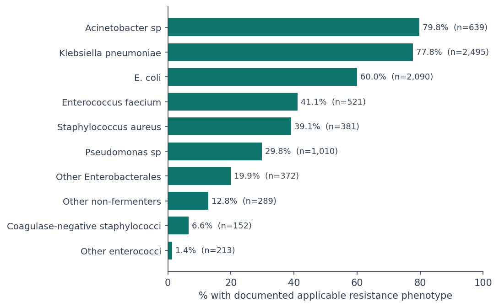
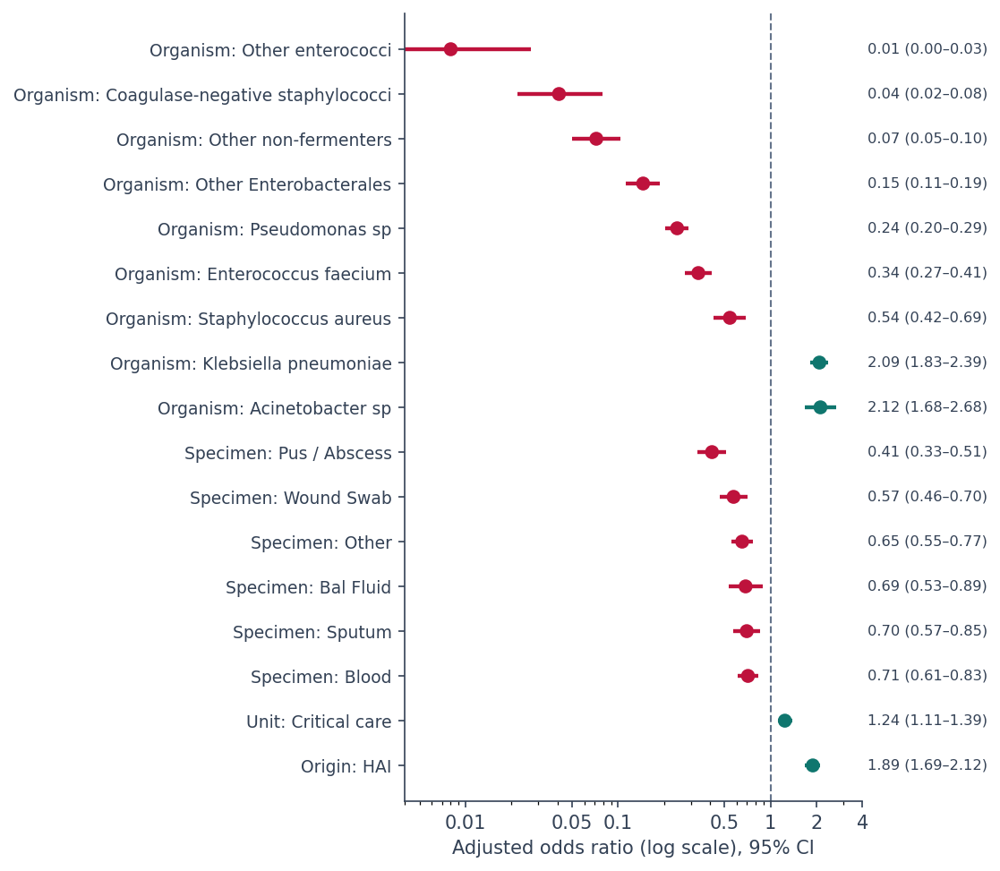
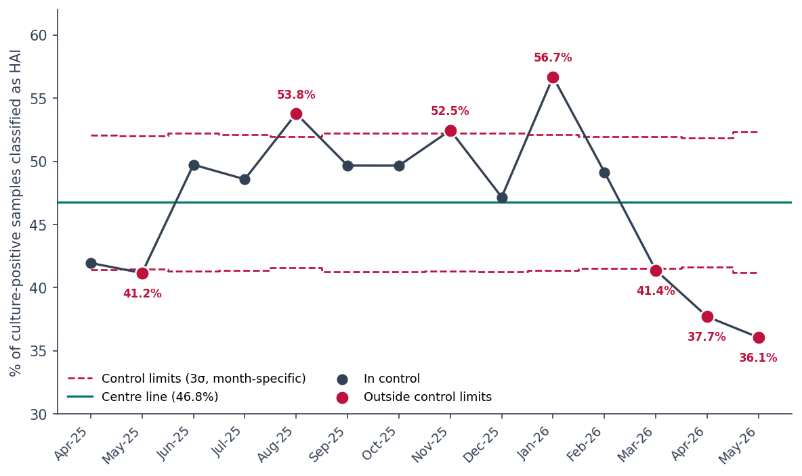

# Hospital Infection Surveillance Analysis

A complete M.Sc. Statistics internship project based on a 14-month tertiary-care hospital microbiology register. The repository brings together the analysis code, aggregate result tables, report-ready figures, final report and Power BI dashboard documentation.

**Study period:** April 2025 - May 2026  
**Scope:** 10,943 distinct culture-positive samples, 12,188 organism isolates, 5,311 patients  
**Author:** Swachchho Gun, M.Sc. Statistics, St. Xavier's University, Kolkata

## Project at a glance

The project follows one clear analytical pipeline:

**Cleaning → descriptive analysis → resistance phenotype profile → chi-square/Cramer's V → logistic regression → prediction → SPC/trend analysis → Power BI dashboard**

The analysis keeps the microbiology register at the **organism-isolate level**, while using **distinct Sample IDs** whenever the question is sample-level. This is important because one culture-positive sample can contain more than one organism.

## What was analysed

### 1. Data preparation and descriptive analysis

The register was standardised before analysis, including organism names, specimen categories, hospital units, infection origin and resistance indicators. Descriptive results use frequencies, proportions, cross-tabulations and monthly summaries.

### 2. Resistance phenotype profile

Six documented phenotypes were evaluated:

**CRE · ESBL · MDR · VRE · MRSA · MR-CoNS**

An a-priori microbiological applicability framework determines which phenotypes are meaningful for each organism class:

| Organism class | Applicable phenotypes |
|---|---|
| Enterobacterales | CRE, ESBL, MDR |
| Non-fermenters | MDR |
| Enterococcus | VRE |
| S. aureus | MRSA |
| CoNS | MR-CoNS |

A blank resistance field is **not** interpreted as confirmed susceptibility. The analysis outcome is **Y = 1** when an applicable resistance phenotype is documented.

### 3. Bivariate association

Chi-square tests with Cramer's V were used to examine documented resistance against:

- organism group
- specimen type
- HAI status
- hospital unit type

Holm correction was applied across the four tests. A one-isolate-per-sample sensitivity analysis was repeated 200 times to check the stability of the substantive conclusions.

### 4. Logistic regression and prediction

A multivariable logistic-regression model includes organism group, specimen type, hospital unit type and infection origin.

- Sample ID is used for **cluster-robust standard errors**.
- Grouped train/test splitting prevents the same sample appearing in both training and testing.
- Grouped 5-fold cross-validation is used for internal validation.
- Performance is summarised with ROC-AUC, Brier score and calibration.

The model is used for **adjusted association analysis and internal prediction**, not causal inference or clinical deployment.

### 5. Statistical process control

A monthly **p-chart** monitors the proportion of culture-positive samples classified as healthcare-associated.

Because monthly sample counts vary, the chart uses **month-specific 3-sigma control limits** rather than fixed horizontal limits. A Cochran-Armitage trend test provides additional evidence about ordered monthly movement.

### 6. Power BI dashboard

The dashboard design has five pages:

1. Overview
2. Organisms
3. Antimicrobial resistance
4. Hospital units
5. Monthly surveillance

The repository includes the dashboard build guide and static screenshots of all five pages.

## Key results

| Metric | Result |
|---|---:|
| Culture-positive samples | **10,943** |
| Organism isolates | **12,188** |
| Patients | **5,311** |
| HAI among culture-positive samples | **46.8%** |
| Eligible isolates for resistance analysis | **8,162** |
| Resistant eligible isolates | **4,491 (55.0%)** |
| Organism-group Cramer's V | **0.473** |
| Specimen-type Cramer's V | **0.149** |
| HAI-status Cramer's V | **0.089** |
| Hospital-unit-type Cramer's V | **0.044** |
| Held-out ROC-AUC | **0.778** |
| Held-out Brier score | **0.190** |
| Grouped 5-fold mean ROC-AUC | **0.781 (SD 0.009)** |
| Months outside SPC limits | **7 of 14** |
| Cochran-Armitage trend | **Z = -3.23, p = 0.001** |

## Repository structure

```text
Hospital-infection-surveillance-analysis/
├── README.md
├── .gitignore
├── requirements.txt
│
├── notebooks/
│   ├── Analysis_Notebook.ipynb
│   └── README.md
│
├── docs/
│   ├── Analysis_Code_Walkthrough.md
│   ├── Dashboard_Build_Guide.md
│   └── Methodology_Summary.md
│
├── figures/
│   ├── figure_4_1.png ... figure_4_8.png
│   ├── figure_5_1.png ... figure_5_7.png
│   ├── figure_6_1.png ... figure_6_5.png
│   └── README.md
│
├── results/
│   ├── project_key_metrics.csv
│   ├── data_dictionary.csv
│   ├── resistance_profile.csv
│   ├── applicability_matrix.csv
│   ├── organism_applicability_audit.csv
│   ├── resistance_anomaly_summary.csv
│   ├── bivariate_association_results.csv
│   ├── bivariate_sensitivity_analysis.csv
│   ├── logistic_adjusted_odds_ratios.csv
│   ├── logistic_threshold_performance.csv
│   ├── logistic_calibration.csv
│   ├── logistic_grouped_cv.csv
│   ├── spc_p_chart_monthly.csv
│   ├── spc_special_cause_signals.csv
│   └── README.md
│
└── report/
    ├── Infection_Surveillance_Report_FINAL.pdf
    └── Infection_Surveillance_Report_FINAL.docx
```

## Start here

**Want the story quickly?** Read this README and open `results/project_key_metrics.csv`.

**Want the code?** Open `notebooks/Analysis_Notebook.ipynb` and read `docs/Analysis_Code_Walkthrough.md` alongside it.

**Want the full written project?** Open `report/Infection_Surveillance_Report_FINAL.pdf`.

**Want the dashboard design?** Open `docs/Dashboard_Build_Guide.md` and the five Chapter 6 screenshots in `figures/`.

## Selected visual outputs

Once the figure files are present in the repository, these give a quick visual tour of the analysis:







## Data and privacy

The underlying hospital microbiology register is **not included** in this public repository.

The repository contains code, aggregate result tables and figures needed to review the analytical workflow without publishing the source register. The resistance anomaly output is deliberately aggregated and does not expose Sample IDs.

## Reproducing the analysis

1. Obtain the approved cleaned analysis workbook used for the project.
2. Place it beside the notebook when running locally, or upload it in Google Colab.
3. Install the packages listed in `requirements.txt`.
4. Run `notebooks/Analysis_Notebook.ipynb` from top to bottom.
5. Compare the regenerated outputs with the aggregate tables in `results/`.

Because the source register is private, the notebook is intentionally written to load a user-supplied copy of the input workbook.

## Tools

Python · Pandas · NumPy · SciPy · statsmodels · scikit-learn · Matplotlib · Microsoft Excel · Power BI

## Portfolio structure

The repository is deliberately separated into three layers:

**Analysis** → notebook and code walkthrough  
**Evidence** → figures and aggregate result tables  
**Deliverables** → final report and dashboard documentation

This keeps the project easy to inspect: a reviewer can see the method, the evidence and the final deliverable without needing the original hospital register.
